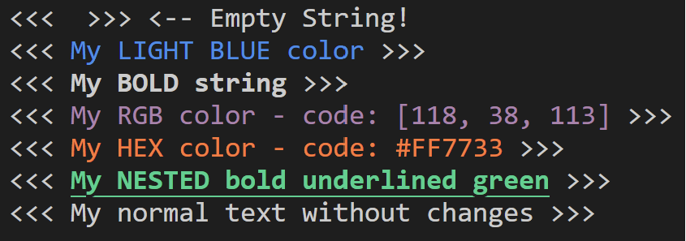

# gach
This is a package to colorize your terminal text messages.

## Install
You can install it by:
`npm i gach`

## Usage
You can use this package like this:
```js
import gach from 'gach'

console.log(`<<<<< ${gach.color('your string', 'red')} >>>>>`)
```

The result will be like below:

Output:


## Supported Colors & Styles
### Colors
Supported colors for both font and background are:
- red
- green
- blue
- yellow
- cyan
- magenta
- gray
- black
- lightRed
- lightGreen
- lightYellow
- lightBlue
- lightMagenta
- lightCyan

### Styles
Supported styles are:
- bold
- italic
- underline
- strikethrough
- inverse
